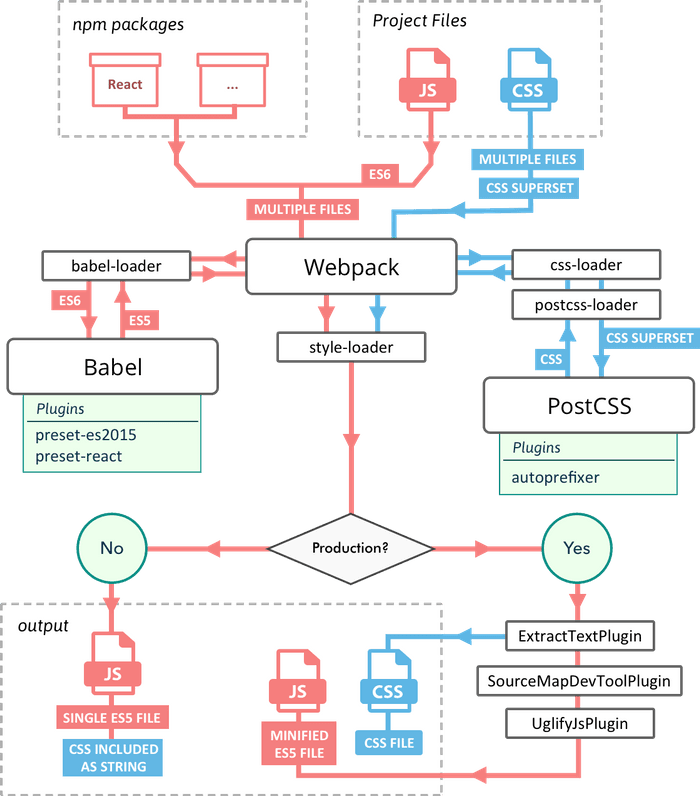
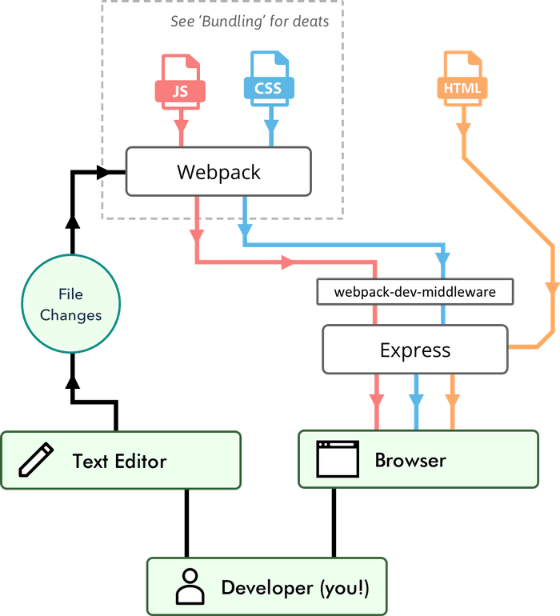

# Build Tools

### Flow Diagram

### [Module Bundler](module-bundler.md)

* Webpack
* Rollup
* Parcel

### [Task Runner](task-runner.md)

* NPM Script
* Gulp

### [Linter](linter.md)

* ESLint
* JSLint
* JSHint
* JSCS

## [Transpiler](transpiler.md)

* Typescript
* Babel

