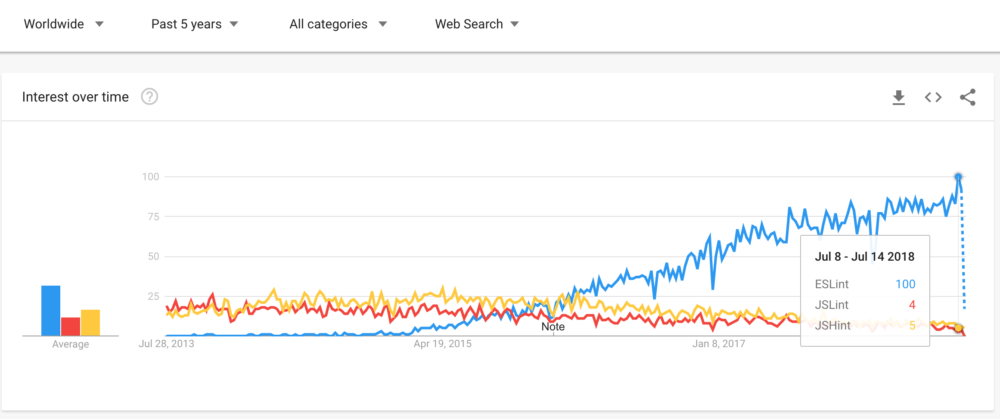

# Linter

## ESLint

* Pluggable javascript linter로 JSHint가 제공하는 기능과 JSCS가 제공하는 코드 스타일 체크 기능 모두 제공
* ES5, 6, JSX등 다양한 포맷 지원
* Webstorm 에 기본 내장

## JSLint

* 더글라스 크락포드가 만든 정적 분석도구
* 엄격

## JSHint

* JSLint에서 파생
* 대부분의 옵션을 키고 끌 수 있는 장점

## JSCS

* Code style linter로 코딩 스타일을 가이드 해준다.

## 결론

그냥 ESLint 쓰면 된다.

### Google trends

### _References_



