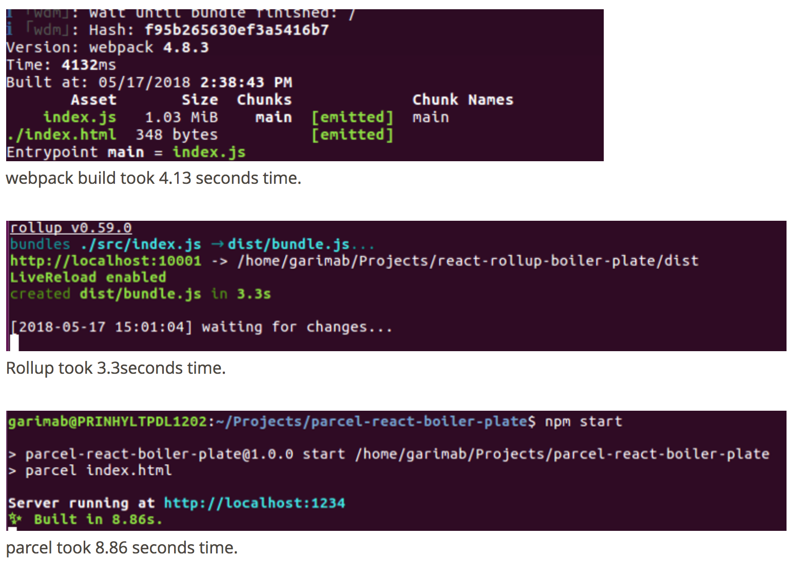
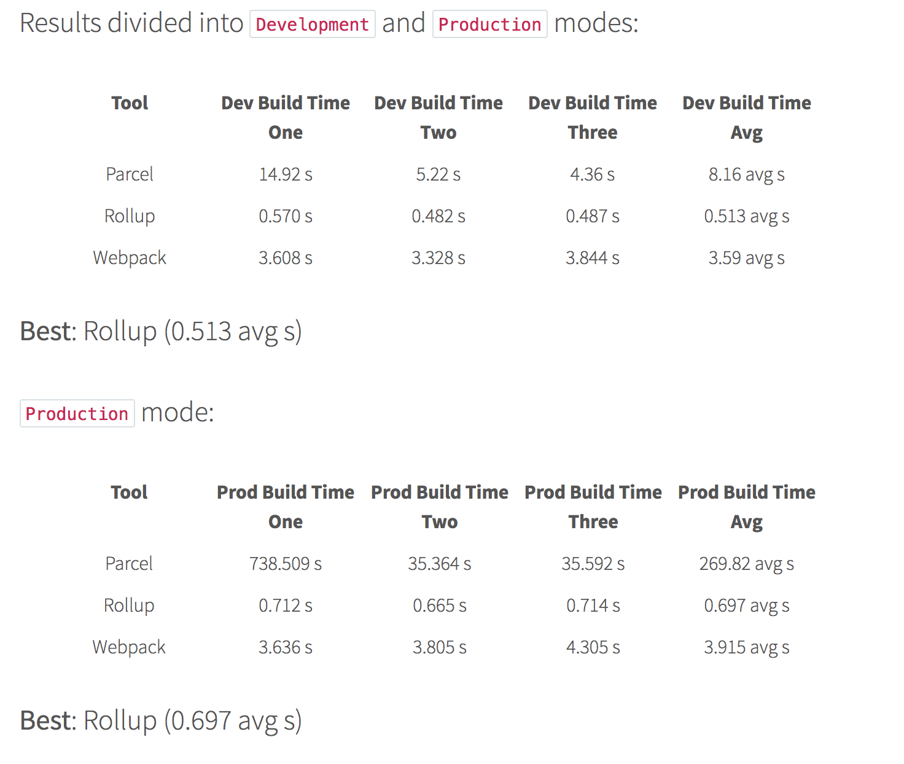
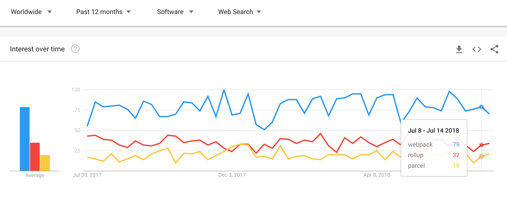

# Module Bundler

## 필요한 이유

성능 최적화와 개발 편의를 위해 사용.

## 무슨 일을 하나?

* 모듈의 의존성을 추적하여 사용하는 코드 베이스를 브라우저에서 서비스 하기 좋은 형태로 번들링
* Loader와 Plugin의 도움으로 소스코드의 변형\(transpile\), 축소\(minify, uglify\) 및 최적화 작업 수행
* HMR\(Hot module replacement\)기능을 포함한 개발 서버 지원

## 어떤 것들이 있나?

### Webpack

* 가장 많이 사용되는 Bundler로 최근 버전4 릴리즈
* Web application의 모든 자산\(HTML, CSS,  Javascript, Image 등\) 관리문제를 해결 하기 위해 등장 

### Rollup

* Webpack 사용자라면 친숙한 Configuration
* 표준화된 모듈 포맷을 사용하여 코드를 작성하고, Dead Code를 제거 경량화된 빌드를 얻어내려는 목적으로 등장 

### Parcel

* 최근에 등장한 초경량 Bundler
* 워커 프로세스를 이용한 멀티 컴파일과 파일시스템 캐시로 빠른 빌드를 위해 등장
* Configuration-free

## 비교

### Configuration

* Rollup은 import/export 를 위한 node polyfill을 가지고 있다. \(Webpack은 없음.\)
* Rollup은 상대경로 지원 \(Webpack은 안됨\)
* Parcel은 설정파일이 필요 없다.

### Entry point

* Webpack, Rollup은 javascript 파일만 가능 \(html등의 다른포맷은 플러그인 설치로 가능\)
* Parcel은 HTML파일을 Entry point로 사용 가능

**Transformations**

* Webpack은 javascript, css, image 등 유형별 로더를 사용
* Rollup은 플러그인 지정
* Parcel은 설정 없이 자동 변

### Tree shaking

* Webpack의 경우 특정 패키 전체가 아닌 사용하는 기능만 ES2015 module syntax로 import 한 후 Dead Code 제거를 위해 UglifyJSPlugin 를 사용
* Rollup은 코드를 정적 분석 하여 사용하지 않는 코드 제거.
* Parcel은 아직 지원 하지 않는다.

### Dev Server

* Webpack - webpack-dev-server plugin
* Rollup - rollup-plugin-serve, rollup-plugin-livereload
* Parcel - 자체 내장 서버

### Speed

### Google trends

## 결론

* 당장 시작하려면 Webpack
* 시간이 있으면 Rollup 써보고
* Parcel은 지켜보자

### _References_

{% embed data="{\"url\":\"https://blog.imaginea.com/comparing-javascript-module-bundlers-webpack-rollup-or-parcel/\",\"type\":\"link\",\"title\":\"Comparing Javascript module bundlers : Webpack , Rollup or Parcel\",\"description\":\"Module Bundling In Javascript: Module Bundling , on a high level , is a process of integrating together group of modules in a single file which can be used by the browser....\",\"icon\":{\"type\":\"icon\",\"url\":\"https://blog.imaginea.com/wp-content/uploads/2015/02/favicon.ico\",\"aspectRatio\":0}}" %}

{% embed data="{\"url\":\"https://x-team.com/blog/rollup-webpack-parcel-comparison/\",\"type\":\"link\",\"title\":\"Rollup v. Webpack v. Parcel\",\"description\":\"2018 is a great year for JavaScript! If you want to see how the new generation of front-end build tools performs, you\'ve come to the right place!\",\"icon\":{\"type\":\"icon\",\"url\":\"https://x-team.com/blog/favicon.png\",\"aspectRatio\":0},\"thumbnail\":{\"type\":\"thumbnail\",\"url\":\"https://res.cloudinary.com/dukp6c7f7/image/upload/f\_auto,fl\_lossy,q\_auto/s3-ghost//2018/05/234hji5h234kij5nh234i.png\",\"width\":1200,\"height\":628,\"aspectRatio\":0.5233333333333333}}" %}

