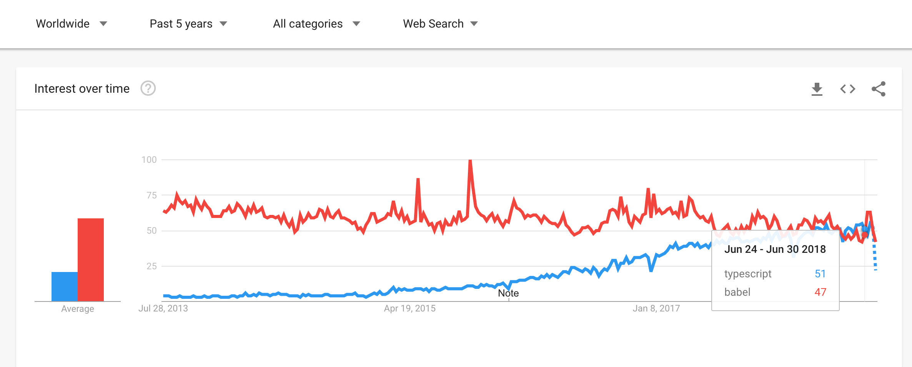

# Transpiler

## Typescript

* Microsoft에서 개발 
* ECMAScript의 차세대 스펙을 특정 런타임 타겟\(ex: es5\)등으로 변환 해줄 뿐만 아니라 Type을 가지는 하나의 언어 그 자체 
* Angular에서는 기본으로 포함하고 있음.
* 러닝 커브 있음 

## Babel

* ECMAScript의 차세대 스펙을 특정 런타임 타겟\(ex: es5\)등으로 변환 
* 순수 Javascript 기반 

### Google trends

