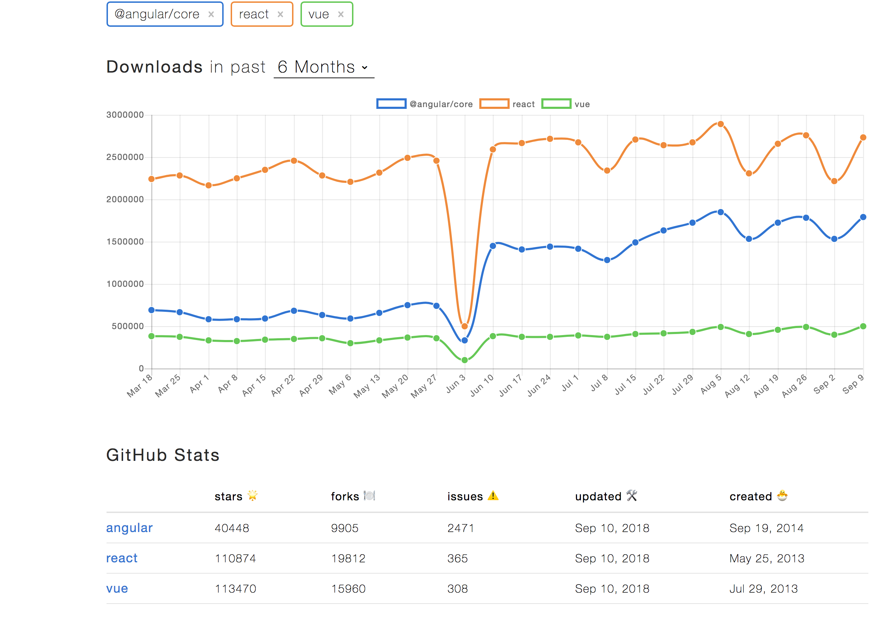
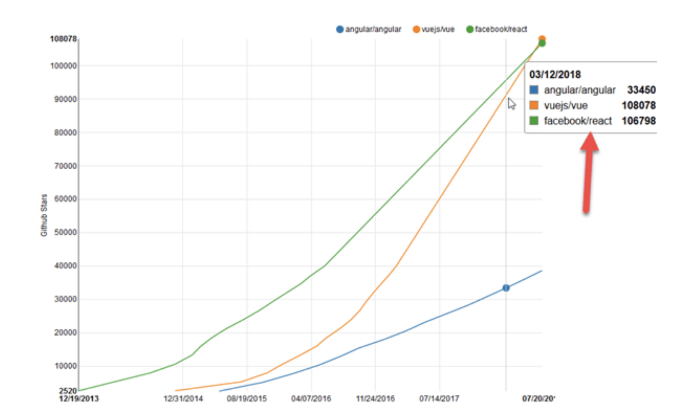

# Framework

### 개요

### A Quick Comparison Angular vs. React vs. Vue

|  | **Angular** | **React** | **Vue** |
| :--- | :--- | :--- | :--- |
| **Type** | A Framework | Library to build UI   | A library |
| **Why Choose** | If you want to use TypeScript | If you want to go for “everything-is-JavaScript” approach   | Easy JavaScript and HTML |
| **Founders** | Powered by Google | Maintained by Facebook | Created by Former Google Employee |
| **Initial Release** | September 2016 | March 2013 | February 2014 |
| **Application Types** | If you want to develop Native apps, hybrid apps, and web apps | If you want to develop SPA and mobile apps | Advanced SPA and started supporting Native apps |
| **Ideal for** | If you want to focus on large-scale, feature-rich applications | Suitable for modern web development and native-rendered apps for iOS and Android | Ideal for web development and single-page applications |
| **Learning Curve** | A steep learning curve | A little bit easier than Angular | A small learning curve |
| **Developer-friendly** | If you want to use the structure-based framework | If you want to have flexibility in the development environment | If you want to have separation of concerns |
| **Model**   | Based on MVC \(Model-View-Controller\) architecture | Based on Virtual DOM \(Document Object Model\) | Based on Virtual DOM \(Document Object Model\) |
| **Written in** | TypeScript | JavaScript | JavaScript |
| **Community Support** | A large community of developers and supporters | Facebook developers community | Open-source project sponsored through crowd-sourcing |
| **Language Preference** | Recommends the use of TypeScript | Recommends the use of JSX – JavaScript XML | HTML templates and JavaScript |
| **Popularity** | Widely popular among developers | More than 27,000 stars added over the year | More than 40,000 stars added on GitHub during the year |
| **Companies Using** | Used by Google, Forbes, Wix, and weather.com | Used by Facebook, Uber, Netflix, Twitter, Reddit, Paypal, Walmart,  and others | Used by Alibaba, Baidu, GitLab, and others    |

## [Vue.js](vue.js/)

## [React](react.md)

## [Angular](angular.md)

## _References_

{% embed data="{\"url\":\"https://medium.com/@TechMagic/reactjs-vs-angular5-vs-vue-js-what-to-choose-in-2018-b91e028fa91d\",\"type\":\"link\",\"title\":\"ReactJS vs Angular5 vs Vue.js — What to choose in 2018?\",\"description\":\"Some time ago we published an article with a comparison of Angular 2 and React. In that article, we showed pros and cons of these…\",\"icon\":{\"type\":\"icon\",\"url\":\"https://cdn-images-1.medium.com/fit/c/304/304/1\*8I-HPL0bfoIzGied-dzOvA.png\",\"width\":152,\"height\":152,\"aspectRatio\":1},\"thumbnail\":{\"type\":\"thumbnail\",\"url\":\"https://cdn-images-1.medium.com/max/2000/1\*P1xMsTVcfWxQ7yLSQOVrfQ.png\",\"width\":1920,\"height\":784,\"aspectRatio\":0.4083333333333333}}" %}

