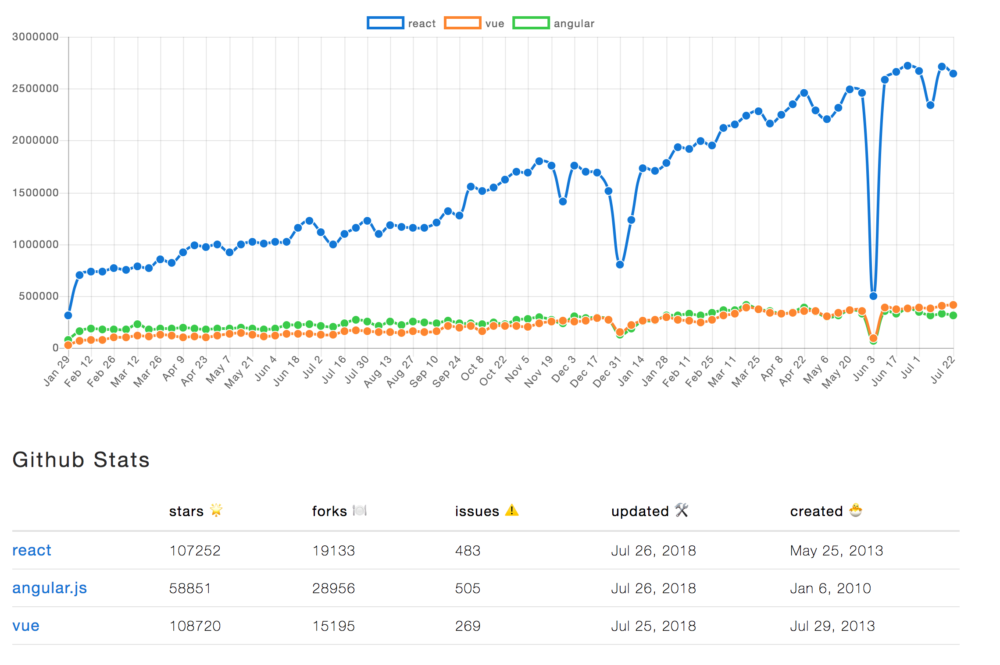

# Framework

#### 개요

### [Vue.js](vue.js/)

### [React](react.md)

### [Angular](angular.md)

### _References_

{% embed data="{\"url\":\"https://medium.com/@TechMagic/reactjs-vs-angular5-vs-vue-js-what-to-choose-in-2018-b91e028fa91d\",\"type\":\"link\",\"title\":\"ReactJS vs Angular5 vs Vue.js — What to choose in 2018?\",\"description\":\"Some time ago we published an article with a comparison of Angular 2 and React. In that article, we showed pros and cons of these…\",\"icon\":{\"type\":\"icon\",\"url\":\"https://cdn-images-1.medium.com/fit/c/304/304/1\*8I-HPL0bfoIzGied-dzOvA.png\",\"width\":152,\"height\":152,\"aspectRatio\":1},\"thumbnail\":{\"type\":\"thumbnail\",\"url\":\"https://cdn-images-1.medium.com/max/2000/1\*P1xMsTVcfWxQ7yLSQOVrfQ.png\",\"width\":1920,\"height\":784,\"aspectRatio\":0.4083333333333333}}" %}

