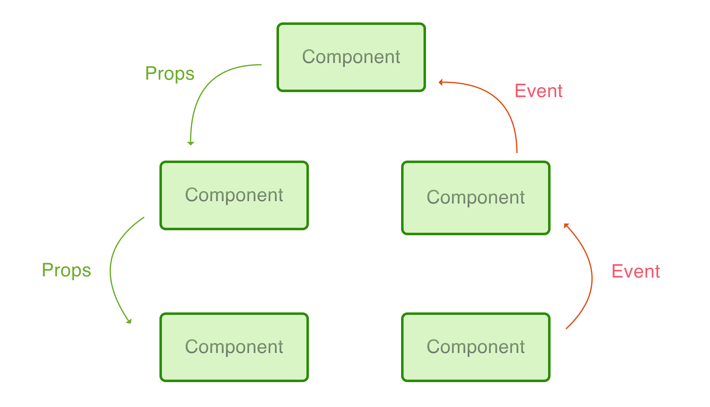

# Component

## 특징

* Vue의 핵심 기능 중 하나 
* HTML을 확장하여 재사용 가능한 코드 작성에 도움 
* 사용자 정의 엘리먼트 


## Component 등록

전역 컴포넌트 예

```javascript
<div id="example">
  <my-component></my-component>
</div>

<script>
  Vue.component('my-component', {
    template: '<div>사용자 정의 컴포넌트 입니다!</div>'
  })

  new Vue({
    el: '#example'
  })
<script>
```

## Data Flow



## Single File Component

```markup
<template>
    <div class="header">
        {{ title }}
    </div>
    <child-component :message="message"/> 
</template>

<script>
import ChildComponent from './ChildComponent.vue'

export default {
    data() {
        return {
            title: 'single file component',
            message: 'message to child component'
        }
    },
    components: {
        ChildComponent
    }
}
</script>

<style scoped>
    .header{
        font-size: 3em;
    }
</style>
```

* 빌드도구를 사용 해야 함
* Component scoped CSS 지원
* 특정  Template engine 사용 가능
* 생산성 향상에 도움을 주는 javascript/css 전처리기 사용 가능
* ES6사용 권장

### Javascript와 CSS 파일 분리 가능

```markup
<template>
    <div> {{ message }}</div>
</template>
<script src="./my-component.js"></script>
<style src="./my-component.css"></style>
```


## Separation of Concerns in Vue.js

* 관심사의 분리가 파일타입의 분리\(css, js 등\)와 같지 않다고 봄
* 현대적인 UI 개발에서 코드베이스를 서로 얽혀있는 세 개의 거대한 레이어\(HTML, CSS, JS\)로 나누는 대신, 느슨하게 결합 된 컴포넌트로 나누고 구성하는 것이 더 중요
* 컴포넌트 내부에서 템플릿, 로직 및 스타일이 본질적으로 결합되어 배치되면 컴포넌트의 응집력과 유지 보수성이 향상됩니다.

