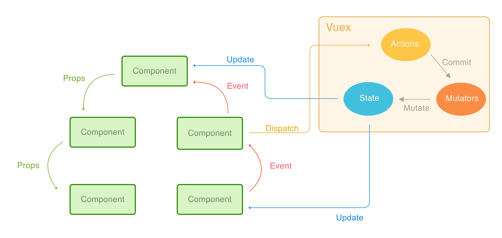

# Vuex

_There is a single-source of truth_

## 데이터 공유의 문제

데이터\(Props\)는 하위 컴포넌트로 전파 되는 것을 통해 데이터의 흐름 쉽게 제어. 하지만,

* 데이터 전파경로가 길어질 경우, 해당 데이터가 필요하지 않는 컴포넌트들이 전파경로에 존재
* 컴포넌트 트리 형제 컴포넌트에게는 데이터 전파가 불가능


## 상태관리패턴

공유되어야 할 상태를 추출하여 전역 싱글톤으로 관리

단방향 데이터 흐름을 통해 데이터 흐름의 복잡도를 낮춤




## 상태

Vuex는 단일 상태 트리를 사용. 원본 데이터의 역

## 변이

* State를 변경하는 유일한 방법
* 동기식 로직만 작성 가능
* State 가 변경되면 해당 State를 관찰하는 Vue 컴포넌트가 자동으로 업데이트됨

```javascript
const store = new Vuex.Store({
  state: {
    count: 1
  },
  mutations: {
    addOne (state) {
      // 상태 변이
      state.count++
    }
  }
})

// Vuex 외부에서의 Mutation 호
store.commit('addOne')
```

## Action

* commit function 을 통해 state 변경을 수행\(state 직접 접근하지 않음\)
* 임의의 비동기식 로직 작성 가능
* Vuex 외부에서 dispatch 를 통해 action을 호출

```javascript
actions: {
  increment ({ commit }) {
    commit('addOne')
  }
}

// Vuex 외부에서의 Action 호
store.dispatch('increment')
```

## 애플리케이션 구조

```text
├── index.html
├── main.js
├── api
│   └── ... # API 요청을 위한 추상화를 포함합니다.
├── components
│   ├── App.vue
│   └── ...
└── store
    ├── index.js          # 모듈을 조합하고 저장소를 내보내는 곳 입니다.
    ├── actions.js        # 루트 액션
    ├── mutations.js      # 루트 변이
    └── modules
        ├── cart.js       # cart 모듈
        └── products.js   # products 모듈
```

