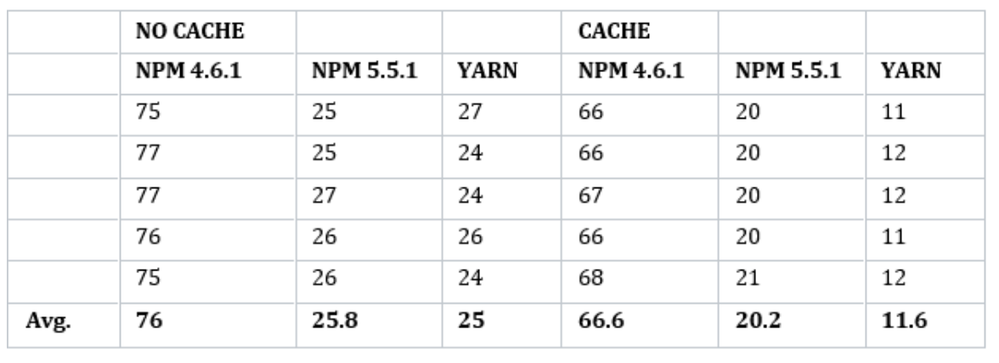
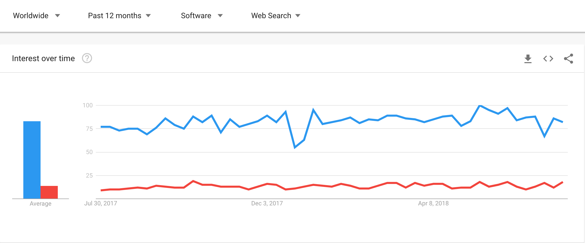

# Package manager

### NPM

* Node Package Manager.
* 가장 많이 사용.
* NPM4 이하 버전에서는 yarn보다 뒤처짐.
* NPM5 이후 속도 개선 및 lock 파일 지원.

### YARN

* Facebook에서 NPM의 일관적, 보안, 특히 성능문제에 직면하여 이를 대체할 패키지 매니저 개발.
* yarn.lock 파일을 통해 동일한 패키지가 모든 장치에 설치됨을 보장. \(5버전 이상의 NPM도 지원\)
* 병렬처리와 캐시 사용으로 패키지 처리 속도 향상.

#### 비고

* NPM 5 버전 이후 성능은 크게 차이 없으나 캐시된 이후 yarn이 빠르다.
* End-point Registry는 함께 사용하나 yarn 전용의  Registry 미러가 있다. \(Facebook에서 패키지 사용 정보 수집\)

#### 속도

#### Google Trends

#### _References_

{% embed data="{\"url\":\"https://jobs.stratsys.com/blog/posts/9244-npm5-vs-yarn-which-one-is-better\",\"type\":\"link\",\"title\":\"npm5 VS Yarn – which one is better?  - \#jobbapåstratsys - Stratsys\",\"description\":\"As a developer, your always stressed for time. This need to launch faster, release faster and YOU have to code faster. For a long time, we used node together with npm4 to handle our package bundlin...\",\"icon\":{\"type\":\"icon\",\"url\":\"https://favicons.teamtailor-cdn.com/icon?url=www3.stratsys.se&size=16..196..500\",\"width\":196,\"height\":196,\"aspectRatio\":1}}" %}

