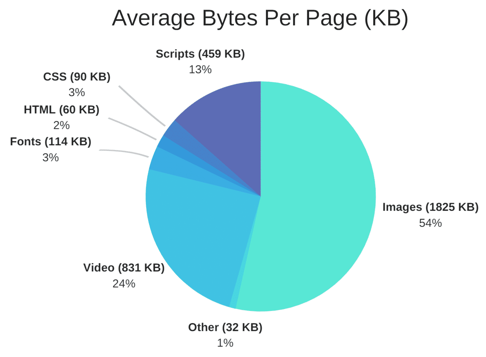
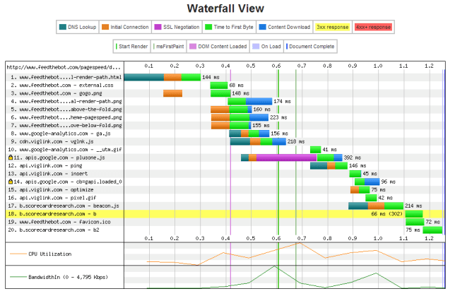

# Web Application Optimization

### 항목

* **Image Optimization**

* **Minify CSS and javascript**
* **Critical path and render blocking resources \(CSS + JS\)**

* **Caching**
* **Enable Gzip Compression**
* **HTTP/2**
* **Reduce HTTP Request**
* Reduce Latency with a CDN
* Time to First Byte \(TTFB\)
* Avoid 301 Redirects
* Prefetch and Preconnect
* Web Font Performance
* Hotlink protection
* Infrastructure
* fix 404 Errors
* Serve Scaled Images
* Database Optimization 

#### References

{% embed data="{\"url\":\"https://www.keycdn.com/blog/website-performance-optimization/\",\"type\":\"link\",\"title\":\"18 Tips for Website Performance Optimization\",\"description\":\"Optimizing and speeding up your website is always something that should be top priority. Check out these 18 tips for website performance optimization.\",\"icon\":{\"type\":\"icon\",\"url\":\"https://cdn.keycdn.com/favicon.ico\",\"aspectRatio\":0},\"thumbnail\":{\"type\":\"thumbnail\",\"url\":\"https://blog.keycdn.com/blog/wp-content/uploads/2016/01/website-performance-optimization-1.png\",\"width\":730,\"height\":365,\"aspectRatio\":0.5}}" %}

{% embed data="{\"url\":\"https://kinsta.com/blog/optimize-images-for-web/\",\"type\":\"link\",\"title\":\"How to Optimize Images for Web and Performance \(2018\)\",\"description\":\"Images are often the \#1 element responsible for slow page load times. Learn how to optimize images for web, as well as performance on your WordPress site.\",\"icon\":{\"type\":\"icon\",\"url\":\"https://kinsta.com/wp-content/themes/kinsta/favicons/apple-touch-icon.png\",\"width\":180,\"height\":180,\"aspectRatio\":1},\"thumbnail\":{\"type\":\"thumbnail\",\"url\":\"https://kinsta.com/wp-content/uploads/2015/11/how-to-optimize-images-for-web-1.png\",\"width\":1460,\"height\":730,\"aspectRatio\":0.5}}" %}



